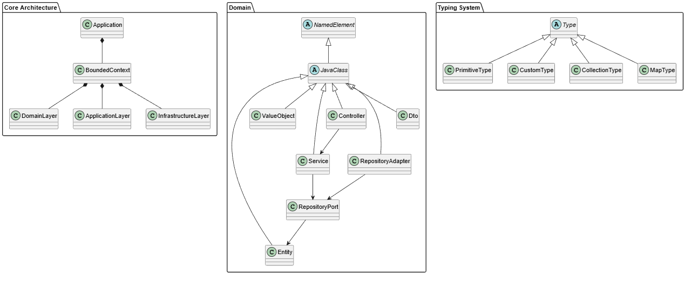
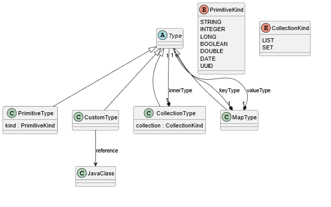
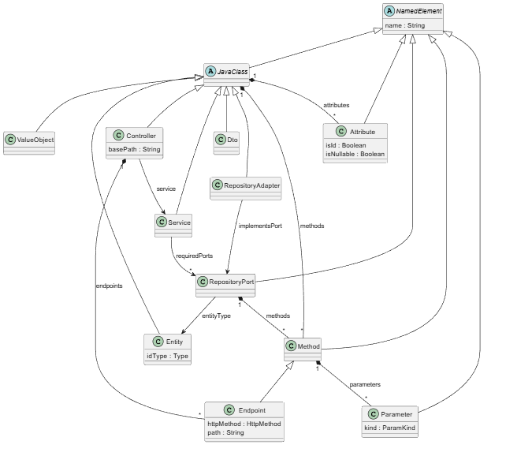
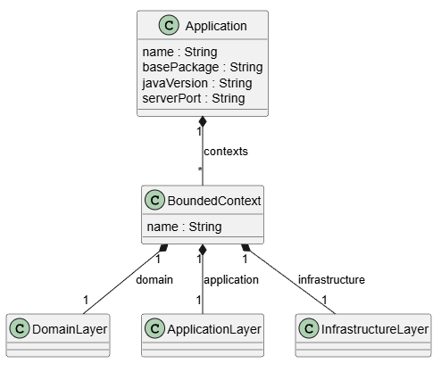

# Para información detallada remitirse al documento `Technical Report.pdf`

# Diccionario de Datos y Uso del Modelo (Arquitectura Hexagonal)

Este modelo abstrae una aplicación Spring Boot bajo una arquitectura hexagonal estricta. Está diseñado para ser agnóstico de la base de datos delegando la implementación física a la capa de infraestructura.

## 1. Enums (Enumeraciones)
* **`HttpMethod`**: Verbos HTTP estándar (`GET`, `POST`, `PUT`, `DELETE`).
* **`ParamKind`**: Origen de un parámetro REST (`PATH`, `QUERY`, `BODY`).
* **`PrimitiveKind`**: Tipos de datos nativos (`STRING`, `INTEGER`, `UUID`, etc.).
* **`CollectionKind`**: Colecciones soportadas (`LIST`, `SET`).

## 2. Sistema de Tipado Exhaustivo
Patrón *Composite* que elimina los tipos en texto plano.
* **`Type`**: Clase abstracta base.
* **`PrimitiveType`**: Tipo simple apoyado en `PrimitiveKind`.
* **`CustomType`**: Referencia cruzada a una clase generada en el modelo (`Entity`, `Dto`, etc.).
* **`CollectionType`**: Envuelve otro `Type` como una lista o conjunto.
* **`MapType`**: Diccionario `Map<K, V>` con tipos recursivos.

## 3. Estructura Hexagonal
* **`Application`**: Raíz del modelo con metadatos base (nombre, paquete, puerto).
* **`BoundedContext`**: Módulo del negocio (ej. `catalog`, `lending`) dividido en 3 capas.
* **`DomainLayer`**: Contiene **Entities**, **Value Objects** y **RepositoryPorts** (Interfaces). Agnóstico de frameworks.
* **`ApplicationLayer`**: Contiene **Services** (Casos de Uso). Orquesta el dominio.
* **`InfrastructureLayer`**: Contiene adaptadores de entrada (**Controllers**), adaptadores de salida (**RepositoryAdapters** para el JSON/DB) y **Dtos**.

## 4. Componentes Base y Específicos
* **`Entity`**: Clase de dominio con identidad (`idType`).
* **`RepositoryPort`**: Contrato de acceso a datos que apunta a una Entidad.
* **`Service`**: Lógica de aplicación. Inyecta dependencias a través de `requiredPorts`.
* **`Controller`**: Punto de entrada con `basePath` y delegación a un `Service`.
* **`RepositoryAdapter`**: Implementación física que resuelve un `RepositoryPort` (ej. leer un JSON).

## 5. Miembros de Clase
* **`Attribute`**: Propiedad tipada de una clase. Incluye `isId` y `isNullable`.
* **`Method`**: Función con `returnType` y `parameters`.
* **`Endpoint`**: Método de controlador con `httpMethod` y `path`.

---

## Cómo usar este modelo en el Editor XMI
1. Crea una instancia dinámica desde el archivo `.ecore` -> Application.
2. Completa la estructura jerárquicamente agregando `New Child`.
3. Para los tipos (`returnType`, `type`, `idType`), selecciona la implementación concreta (ej. `PrimitiveType` o `CollectionType`).
4. Usa las Propiedades (Properties View) para rellenar los atributos y enlazar referencias (`ref`).

---

# Guía de Casos de Uso: Modelado Avanzado en XMI

Esta guía explica cómo utilizar el modelo EMF para diseñar escenarios completos de una aplicación REST. El principio fundamental del modelo es el **tipado fuerte**: no escribimos los tipos (como "String" o "BookDto") a mano, sino que los construimos anidando nodos y referenciando objetos.

A continuación, se detallan los casos de uso más comunes y cómo armarlos paso a paso en el editor de Eclipse.

---

## Caso de Uso 1: Crear un recurso (POST con Request Body)
**Objetivo:** Modelar un endpoint para crear un libro, recibiendo un JSON en el cuerpo de la petición.

1. **Crear el DTO de entrada (Infraestructura):**
   * En `Infrastructure Layer` > `New Child` > `Dtos Dto` (`name` = CreateBookDto).
   * Agrega sus atributos (ej. `title`, `author`) usando `New Child` > `Attributes Attribute` y asígnales un `PrimitiveType`.
2. **Definir el Método en el Puerto y Servicio (Dominio/Aplicación):**
   * En `BookRepositoryPort` y `LibraryService`, agrega un método `createBook`.
   * Clic derecho en el método > `New Child` > `Parameters Parameter` (`name` = bookData).
   * Clic derecho en el parámetro > `New Child` > `Type Custom Type` y en `reference` selecciona la entidad `Book`.
3. **Crear el Endpoint (Infraestructura):**
   * En `BookController`, agrega un `Endpoint` (`name` = create, `httpMethod` = POST, `path` = /).
   * Clic derecho en el Endpoint > `New Child` > `Parameters Parameter` (`name` = request).
   * En sus propiedades, define **`kind` = BODY** (esto le dirá al EGL que genere un `@RequestBody`).
   * Clic derecho en el parámetro > `New Child` > `Type Custom Type` y en `reference` selecciona `CreateBookDto`.

---

## Caso de Uso 2: Buscar o Eliminar por ID (Path Variable)
**Objetivo:** Modelar un endpoint que reciba un ID por la URL (ej. `/api/books/{id}`).

1. **Crear el Endpoint:**
   * En `BookController`, agrega un `Endpoint` (`name` = getById, `httpMethod` = GET, `path` = /{id}).
2. **Definir el Parámetro de Ruta:**
   * Clic derecho en el Endpoint > `New Child` > `Parameters Parameter` (`name` = id).
   * En las propiedades, define **`kind` = PATH** (generará un `@PathVariable`).
   * Clic derecho en el parámetro > `New Child` > `Type Primitive Type` (`kind` = UUID o el tipo que corresponda a tu ID).
3. **Definir el Retorno:**
   * Clic derecho en el Endpoint > `New Child` > `Return Type Custom Type`.
   * En `reference`, selecciona tu `BookDto` (ya que retorna un solo elemento, no usamos `CollectionType`).

---

## Caso de Uso 3: Filtrar resultados (Query Parameters)
**Objetivo:** Modelar una búsqueda con parámetros opcionales en la URL (ej. `/api/books?author=Tolkien`).

1. **Crear el Endpoint:**
   * En `BookController`, agrega un `Endpoint` (`name` = search, `httpMethod` = GET, `path` = /search).
2. **Definir los Parámetros de Consulta:**
   * Agrega un `Parameter` (`name` = author).
   * En las propiedades, define **`kind` = QUERY** (generará un `@RequestParam`).
   * Agrega su tipo (`Type Primitive Type`, `kind` = STRING).
3. **Conectar con la lógica:**
   * Replica este método `search` y sus parámetros en el `Service` y en el `RepositoryPort` para que el flujo completo reciba el filtro.

---

## Caso de Uso 4: Modelar Relaciones Complejas (Préstamo de un Libro)
**Objetivo:** Crear un flujo que involucre dos entidades distintas (Préstamo y Libro).

1. **Modelar las Entidades (Dominio):**
   * Asegúrate de tener la entidad `Book`.
   * Crea la entidad `Loan` (Préstamo).
   * Agrega un atributo a `Loan` (`name` = book). En lugar de usar un tipo primitivo, agrega un **`Type Custom Type`** y en `reference` selecciona la entidad `Book`.
   * *Nota: El EGL interpretará esto como una relación entre objetos (ej. para inyectar `@ManyToOne` si se usara JPA, o anidar JSON).*
2. **Crear los Contratos (Dominio):**
   * Crea un `RepositoryPort` llamado `LoanRepositoryPort` con `entityType` apuntando a `Loan`.
3. **Crear el Caso de Uso (Aplicación):**
   * Crea un `Service` llamado `LoanService`.
   * En sus dependencias (`requiredPorts`), puedes seleccionar múltiples puertos (ej. selecciona `LoanRepositoryPort` para guardar el préstamo, y `BookRepositoryPort` para verificar si el libro existe).
4. **Exponer la Operación (Infraestructura):**
   * Crea el `LoanController`.
   * Agrega un endpoint `POST` (`path` = /borrow).
   * Recibe un `DTO` por el `BODY` (ej. `LoanRequestDto` que contenga el `userId` y el `bookId`).

---

# Diagramas

## General

## Tipos

## Núcleo

## Arquitectura
